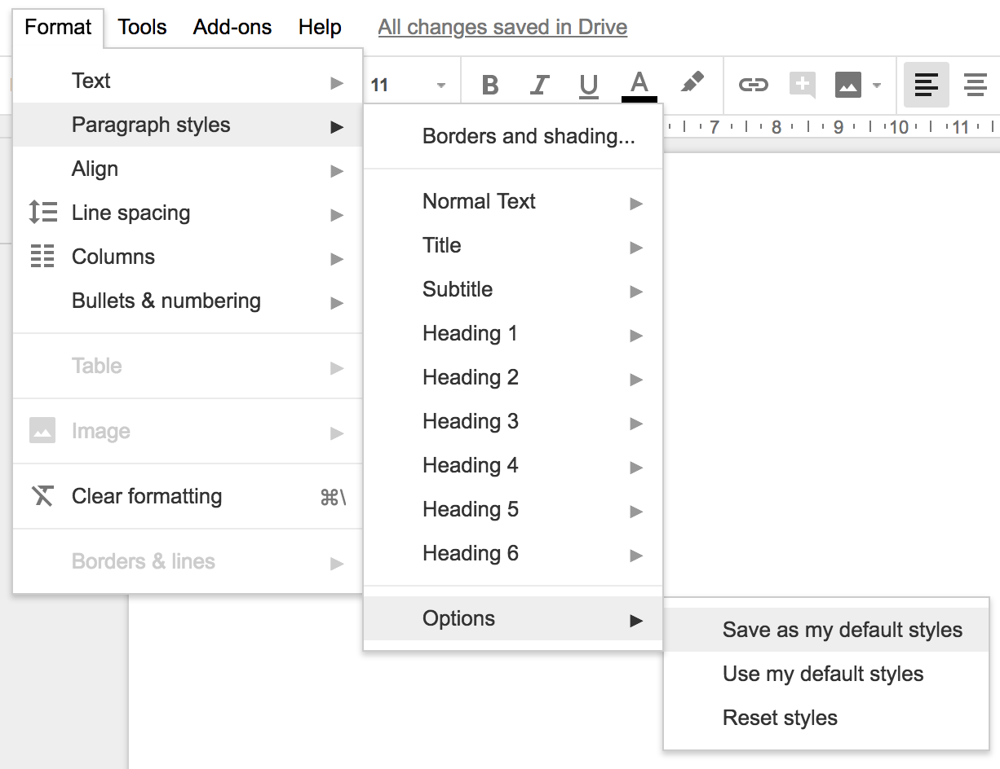

# Save default styles

I use Google Docs for both work and personal stuff. I always change the default font in new documents because I find Arial gross. Given how simplistic Google Docs is when it comes to styles (eg. no custom styles such as `code`) I had always assumed that it offered no way to save them for all new documents.

It turns out that it *does* offer this feature, though it is buried in a place that wasn't obvious to me:

Format &rarr; Paragraph styles &rarr; Options &rarr; Save as my default styles

Google loves to move things around, so no doubt this will become incorrect at some point.